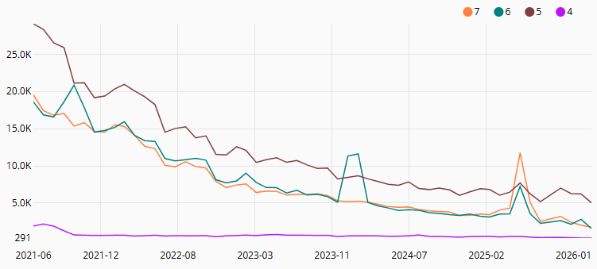

# Laravel Modern Factories

This package brings modern Laravel Factories (circa Laravel 8) to older versions of Laravel,
with the aim of helping legacy applications update to modern Laravel.

[](https://laravel.com/)
[](https://php.net/)
[](https://github.com/tylernathanreed/laravel-modern-factories/actions/workflows/guardrails.yml)

**Usage of Laravel 7 and older is waning, but it ain't zero. Trying to upgrade? Maybe this package can help.**



## Table of Contents
- [Introduction](#introduction)
- [Installation](#installation)
- [Versioning](#versioning)
- [Usage](#usage)

## Introduction

If you're still using Laravel 7 or older, you already know that it's high time to upgrade, but let's be real, there's probably some roadblocks in the way.
One of the roadblocks I've been faced having confidence that I don't break anything when upgrading. There are a few tools to combat this:

- [Laravel Shift](https://laravelshift.com/)
- [Larastan](https://github.com/larastan/larastan) (requires Laravel 6.x or greater) or [PHPStan](https://github.com/phpstan/phpstan) (requires PHP 7.1 or greater)
- [PHPUnit](https://github.com/sebastianbergmann/phpunit) (requires PHP 5.3 or greater)

This package is meant to aid your investment in automated testing via [PHPUnit](https://github.com/sebastianbergmann/phpunit).
When you're behind on your version of Laravel, you've got technical debt.
Usually, upgrading your version of Laravel is a common blocker for multiple avenues of addressing your technical debt.
That said, if you're paying down your technical debt by writing automated tests using legacy Laravel Factories, there's effectively a tax associated with every payment, as once you get to Laravel 8, you'll be pressured to upgrade to modern Laravel Factories.
You can use [laravel/legacy-factories](https://github.com/laravel/legacy-factories) to keep moving forward with your legacy factories, but let's be real, that's not what you want either.

## Installation

Install this package using composer:

```
composer require reedware/laravel-modern-factories
```

This package doesn't use any facades or service providers.

## Versioning

This package targets the feature set of [Laravel 8.x Eloquent Factories](https://laravel.com/docs/8.x/database-testing#defining-model-factories). If you're on Laravel 8 or greater, don't use this package; just use the native Eloquent Factories.

The following Laravel and PHP versions are supported:

| Package   | Laravel   | PHP       | EOL                 |
| --------- | --------- | --------- | ------------------- |
| 1.x       | 5.3       | 5.6       | August 23rd, 2017   |
| 1.x       | 5.4       | 5.6       | January 24th, 2018  |
| 2.x       | 5.4       | 7.0 - 7.2 | January 24th, 2018  |
| 2.x       | 5.5 (LTS) | 7.0 - 7.3 | August 30th, 2020   |
| 2.x       | 5.6       | 7.1 - 7.3 | February 7th, 2019  |
| 2.x       | 5.7       | 7.1 - 7.3 | September 4th, 2019 |
| 2.x       | 5.8       | 7.1 - 7.4 | February 26th, 2020 |
| 2.x       | 6 (LTS)   | 7.2 - 8.0 | September 6th, 2022 |
| 2.x       | 7         | 7.2 - 8.0 | March 3rd, 2021     |

## Usage

Refer to the [Laravel 8.x Documentation on Eloquent Factories](https://laravel.com/docs/8.x/database-testing#defining-model-factories). This package autoloads into the `Illuminate\Database\Eloquent\Factories` namespace (which isn't used prior to Laravel 8), so the documentation can be followed verbatim.

### Changes for 5.6 or Older

The `new` and `for` keywords are not allowed as method names. You can use `newFactory` and `forModel` instead.
Newer versions of PHP (7.0 or greater) can use the `new` and `for` methods as-is.
